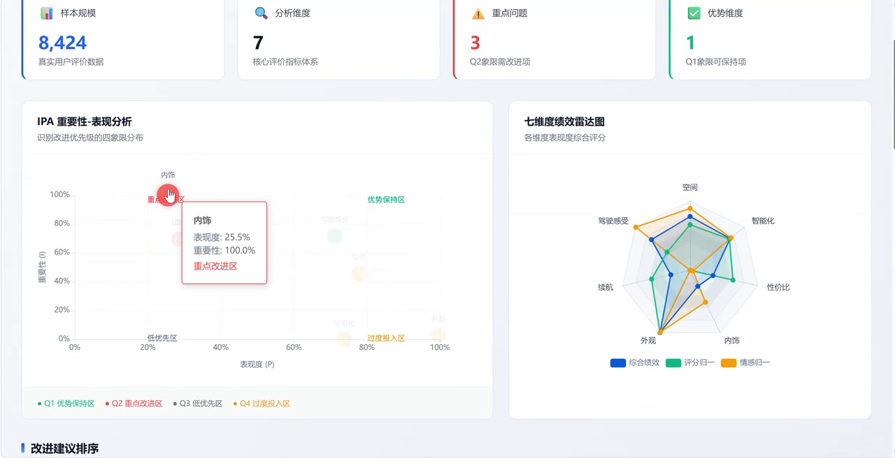
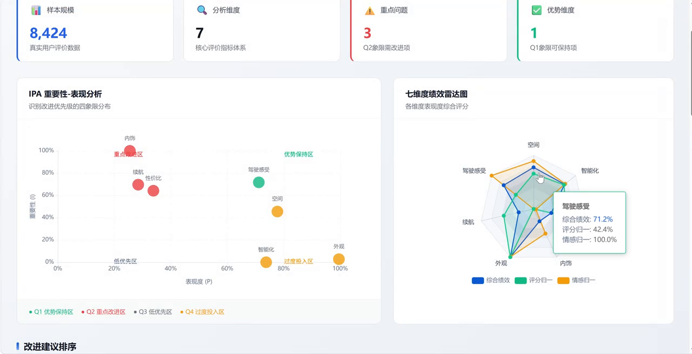
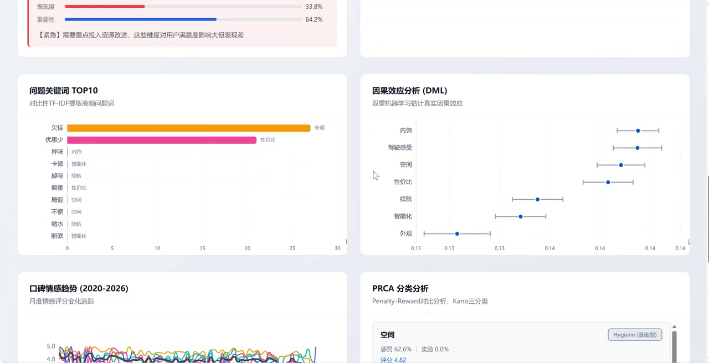
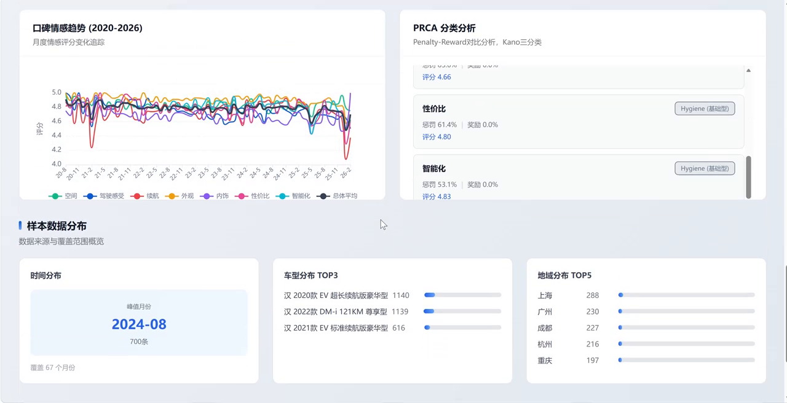

<div align="center">

# BYD Han Review Analytics

**Turning 8,424 owner reviews into an interpretable product-improvement agenda.**

`Python` · `RoBERTa` · `XGBoost` · `SHAP` · `Vue 3` · `ECharts`

</div>

<table>
<tr>
<td colspan="2"></td>
</tr>
<tr>
<td width="50%"></td>
<td width="50%"></td>
</tr>
<tr>
<td colspan="2"></td>
</tr>
</table>

This project combines seven product-dimension ratings with Chinese review text to identify where an already highly rated vehicle still creates friction for owners. The analysis is delivered through an interactive decision dashboard built for product teams rather than as a collection of standalone notebooks.

## Highlights

- **8,424 Autohome owner reviews** across space, driving, range, appearance, interior, value and intelligence.
- **Text-and-rating fusion** using RoBERTa-based sentiment signals to separate dimensions whose explicit ratings cluster near five stars.
- **Interpretable modelling** with XGBoost, SHAP, importance-performance analysis and penalty-reward analysis.
- **Decision-ready delivery** through a Vue 3 and ECharts dashboard backed by committed analysis outputs.

## Key findings

The dashboard reads directly from the committed JSON in `frontend/public/data/`.

| Finding | Product implication |
| --- | --- |
| **Interior ranks first on the improvement agenda** | Negative reviews concentrate on smell, plastic feel and dated styling |
| **Range ranks second** | Complaints focus on battery drop and real-world range shrinkage |
| **Driving is a relative strength** | It remains high-performing in the importance-performance view |
| **Space behaves as a hygiene factor** | Poor performance hurts satisfaction, while excellence adds limited incremental reward |

Explicit aspect ratings average roughly `4.7–4.9 / 5`, leaving little separation between dimensions. Review text supplies the contrast needed to expose the issues hidden by that ceiling effect.

## Analysis pipeline

| Stage | Implementation | Output |
| --- | --- | --- |
| Data preparation | `scripts/01`–`04` | Cleaned and de-duplicated review records |
| Sentiment analysis | `scripts/05` | RoBERTa-based sentiment scores |
| Signal fusion | `scripts/06`–`07` | Text features, keywords and fused performance signals |
| Attribution | `scripts/08`–`10` | Feature importance, SHAP decomposition and adjusted robustness analysis |
| Decision analysis | `scripts/11`–`12` | Importance-performance and penalty-reward quadrants |
| Delivery | `scripts/13`, `convert_csv_to_json.py` | Report assets and dashboard JSON |

The source includes seven explicit 1–5 ratings but no standalone overall-satisfaction field. The workflow therefore treats the modelling stages as interpretable association and decision-support analysis rather than as proof of causal effects.

## Run the dashboard

```bash
cd frontend
npm install
npm run dev
```

Open `http://127.0.0.1:5173`. The dashboard runs from the committed JSON outputs, so exploring the result does not require the original review corpus or a GPU.

Re-running the full analytical pipeline requires the source corpus and model weights. After sentiment inference, the remaining stages use pandas, scikit-learn, XGBoost and SHAP on a single machine.

## Repository structure

```text
scripts/                 staged analytics pipeline
frontend/src/            Vue 3 dashboard
frontend/public/data/    committed dashboard-ready results
docs/                    methodology assets
requirements.txt         Python analysis dependencies
```

## Project context

**Role:** Sole Technical Developer for a team competition entry. Designed the analytical pipeline, implemented the dashboard and co-authored the competition report. The project received a Northwest regional third prize in the Chinese Collegiate Computing Competition.

## License

See [LICENSE](LICENSE) for portfolio and evaluation terms.
